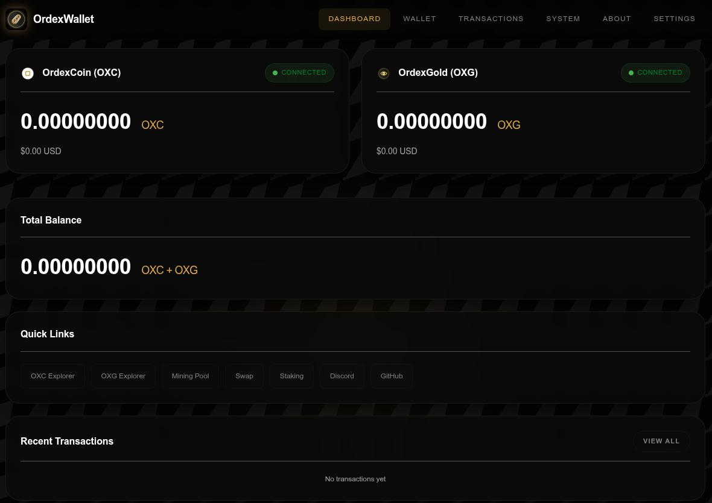
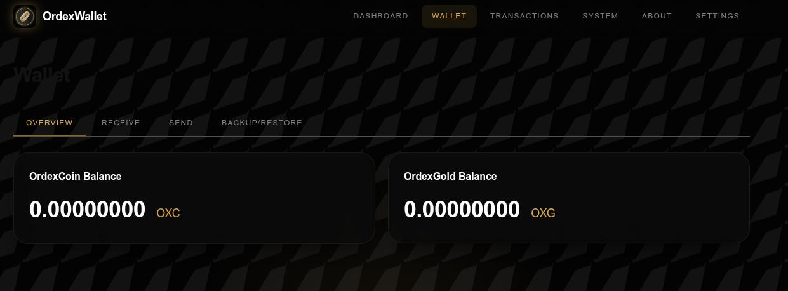

# OrdexWallet

A custodial web wallet for OrdexNetwork - run your own self-hosted wallet for OrdexCoin (OXC) and OrdexGold (OXG).

## Quick Setup

### 1. Clone the Repository

```bash
git clone https://github.com/rnts08/ordex-wallet.git
cd ordex-wallet
```

### 2. Start the Wallet (Daemons Auto-Download)

The daemon binaries are automatically downloaded during the Docker build if not present in the `bin/` directory.

```bash
cd docker
docker compose up -d
```

The wallet will be available at `http://localhost:15000`

## Deployment Options

### Standalone Docker (Recommended for Local/Self-Hosted)

```bash
cd docker
docker compose up -d
```

Access at: `http://localhost:15000`

### Umbriel App Store

See [UMBREL.md](./ordex-wallet/UMBREL.md) for publishing instructions.

The codebase is shared between both deployment options - `backend/`, `frontend/`, and `bin/` are used by both.

## Features

- **Dashboard**: Real-time balance display for OXC and OXG, network sync status, recent transactions
- **Wallet Management**: Create new wallets or import existing ones with private keys
- **Transactions**: Send OXC/OXG to any address, generate receive addresses, view transaction history
- **Backup & Restore**: Encrypted wallet backups with optional passphrase protection
- **System Management**: Daemon configuration, RPC console, system statistics, audit logging
- **Message Signing**: Sign and verify messages with wallet addresses

## Screenshots


*Dashboard showing real-time balances and network status*


*Wallet management interface with backup/restore functionality*

## Prerequisites

- Docker Engine 20.10+
- Docker Compose v2+
- 2GB+ RAM recommended
- 10GB+ storage for blockchain data

**Daemon Binaries**: Automatically downloaded during Docker build from:
- OrdexCoin: https://github.com/OrdexCoin/Ordexcoin-Core/releases/download/V.25.0/ordexcoin-25.0-linux.tar.gz
- OrdexGold: https://github.com/OrdexCoin/OrdexGold-Core/releases/download/V.0.21.04/ordexgold-0.21.4-linux.tar.gz

## Configuration

### Environment Variables

| Variable | Default | Description |
|----------|---------|-------------|
| `PORT` | 5000 | Flask server port (internal) |
| `HOST` | 0.0.0.0 | Flask server host |
| `CONFIG_DIR` | /data/config | Daemon config directory |
| `DATA_DIR` | /data | Data storage directory |
| `FLASK_ENV` | production | Flask environment |

### RPC Ports

| Daemon | Default Port |
|--------|---------------|
| ordexcoind | 25173 |
| ordexgoldd | 25466 |

### Volumes

All data persists in the `ordexwallet_data` Docker volume:
- `/data/config` - Daemon configuration files
- `/data/blockchain/ordexcoin` - OrdexCoin blockchain data
- `/data/blockchain/ordexgold` - OrdexGold blockchain data
- `/data/ordexwallet.db` - Application database
- `/data/backups` - Wallet backups
- `/data/logs` - Application logs
- `/data/bin` - Daemon binaries (mounted from host)

## Operations

### Starting the Wallet

```bash
cd docker
docker compose up -d
```

### Stopping the Wallet

```bash
cd docker
docker compose down
```

### Viewing Logs

```bash
docker compose logs -f
```

### Rebuilding After Updates

```bash
docker compose down
docker compose build --no-cache
docker compose up -d
```

### Accessing Shell

```bash
docker compose exec ordexwallet bash
```

## Upgrading OrdexWallet

### Checking for Updates

```bash
git fetch origin
git status
```

### Upgrading Application Code

```bash
# Pull latest changes
git pull origin main

# Rebuild and restart
cd docker
docker compose down
docker compose build --no-cache
docker compose up -d
```

### Upgrading Daemon Binaries

The Docker build automatically downloads the latest daemon versions. To force an upgrade:

```bash
cd docker
docker compose down

# Remove old daemons (build will re-download)
rm bin/ordexcoind bin/ordexgoldd

# Rebuild (daemons will be auto-downloaded)
docker compose build --no-cache
docker compose up -d
```

### Creating Stable Releases

The project uses git tags for stable release management:

```bash
# Checkout the latest release
git checkout v1.1.0

# Or checkout the main branch for development
git checkout main
```

### Release Versioning

- **Tags format**: `vX.Y.Z` (e.g., v1.1.0)
- **Version meaning**:
  - X: Major version (breaking changes)
  - Y: Minor version (new features)
  - Z: Patch version (bug fixes)

### Checking Current Versions

```bash
# Check application version (if tagged)
git describe --tags

# Check daemon versions in config
cat bin/ordexcoind --version
cat bin/ordexgoldd --version

# Or via RPC in the wallet UI (System > RPC Console)
getblockchaininfo
```

## Wallet Management

### Creating a New Wallet

1. Open the wallet in your browser
2. Navigate to the Wallet page
3. Click "Create New Wallet"
4. Optionally set a backup passphrase
5. Save your addresses - the wallet is ready to receive OXC/OXG

### Importing an Existing Wallet

1. Navigate to Wallet > Backup/Restore
2. Click "Import Wallet"
3. Enter your private key (WIF format)
4. Select the network (OrdexCoin or OrdexGold)
5. Optionally set a backup passphrase
6. The imported addresses will become available

### Creating a Backup

1. Navigate to Wallet > Backup/Restore
2. Click "Create Backup"
3. If you set a passphrase during wallet creation, enter it now
4. A backup file will be downloaded - keep it safe

### Restoring from Backup

1. Navigate to Wallet > Backup/Restore
2. Click "Restore Backup"
3. Upload your backup file
4. Enter the passphrase if the backup is encrypted
5. Your wallet will be restored

## Sending Transactions

1. Navigate to Wallet > Send
2. Select the network (OXC or OXG)
3. Enter the recipient address
4. Enter the amount
5. Optionally customize the fee
6. Click "Send Transaction"
7. Confirm the transaction

## Directory Structure

```
ordex-wallet/
├── backend/          # Python Flask application (shared)
├── frontend/         # Web UI files (shared)
├── bin/              # Daemon binaries (shared)
├── docker/           # Standalone Docker deployment
│   ├── Dockerfile
│   ├── docker-compose.yml
│   └── entrypoint.sh
├── ordex-wallet/     # Umbriel App Store format
│   ├── Dockerfile
│   ├── docker-compose.yml
│   ├── umbrel-app.yml
│   └── exports.sh
├── README.md         # This file
├── RELEASES.md       # Release notes
└── UMBREL.md         # Umbriel publishing guide
```

## External Links

| Service | URL |
|---------|-----|
| Block Explorer (OXC) | https://explorer.ordexcoin.com |
| Block Explorer (OXG) | https://explorer.ordexgold.com |
| Swap | https://ordexswap.online |
| Network Site | https://ordexnetwork.org |
| OrdexCoin GitHub | https://github.com/OrdexCoin/Ordexcoin-Core |
| OrdexGold GitHub | https://github.com/OrdexCoin/OrdexGold-Core |

## API Reference

### Wallet Endpoints

```
POST /api/wallet/create - Create new wallet
POST /api/wallet/import - Import existing wallet
GET  /api/wallet/info - Get wallet information
POST /api/wallet/backup - Create wallet backup
POST /api/wallet/restore - Restore from backup
POST /api/wallet/sign-message - Sign a message
POST /api/wallet/verify-message - Verify signature
```

### Asset Endpoints

```
GET /api/assets - Get all assets with balances
GET /api/assets/ordexcoin - Get OXC details
GET /api/assets/ordexgold - Get OXG details
```

### Transaction Endpoints

```
GET  /api/transactions - List transactions
GET  /api/transactions/{txid} - Get transaction details
POST /api/transactions/send - Send transaction
GET  /api/transactions/receive - Get receive addresses
POST /api/transactions/receive/generate - Generate new address
```

### System Endpoints

```
GET  /api/system/health - Health check
GET  /api/system/stats - System statistics
GET  /api/system/logs - Audit logs
GET  /api/system/config - Get daemon configuration
POST /api/system/config - Update daemon configuration
POST /api/system/rpc-console - Execute RPC command
```

## Support

This is an open-source project maintained by the OrdexNetwork community. To support the development efforts donate to the following addresses:

    * BTC: bc1qkmzc6d49fl0edyeynezwlrfqv486nmk6p5pmta
    * ETH/ERC-20: 0xC13D012CdAae7978CAa0Ef5B1E30ac6e65e6b17F
    * LTC: ltc1q0ahxru7nwgey64agffr7x89swekj7sz8stqc6x
    * SOL: HB2o6q6vsW5796U5y7NxNqA7vYZW1vuQjpAHDo7FAMG8
    * XRP: rUW7Q64vR4PwDM3F27etd6ipxK8MtuxsFs

To support tests and implementation with the ordexnetwork, you can help by donating tokens that will be used for testing and refining the system. 

    * OXC: oxc1q3psft0hvlslddyp8ktr3s737req7q8hrl0rkly
    * OXG: oxg1q34apjkn2yc6rsvuua98432ctqdrjh9hdkhpx0t

For issues and contributions, visit the repository.

## License

See [LICENSE.md](LICENSE.md) for details.

Copyright (c) 2026 ORDEX PROTOCOL. All rights reserved.
